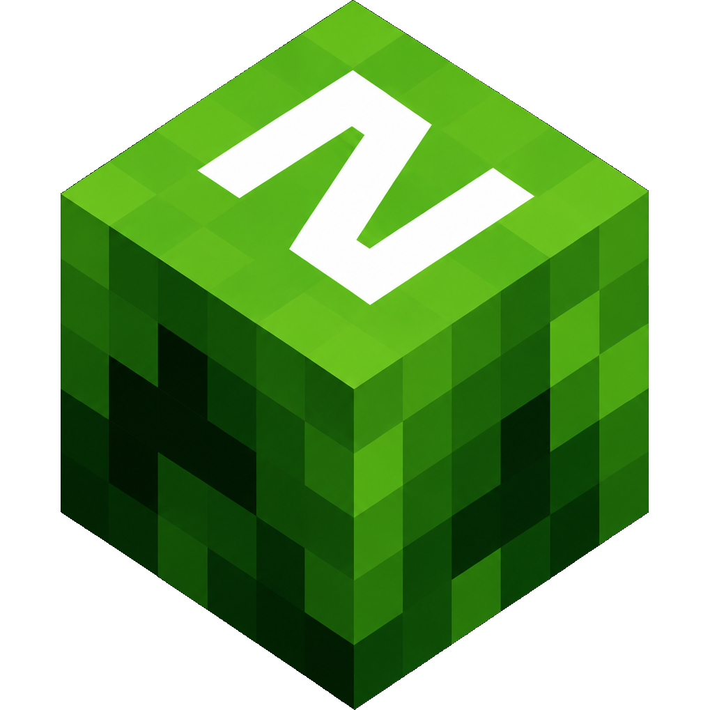

<p align="center">
  
</p>
<div align="center">

# Prism Launcher, Reimagined

</div>
# zLauncher

A modern, open-source Minecraft launcher built with Electron. It downloads and installs Minecraft versions, mod loaders, mods and modpacks, manages Java runtimes automatically, and launches the game from a clean dark-themed desktop UI.
## Features

- **Full version history** — installs every release, snapshot, `old_alpha` and `old_beta` version straight from Mojang's version manifests (v2 merged with the legacy manifest for 1.7.10 and older).
- **Automatic installation** — client jar, libraries, native libraries and assets are downloaded with concurrent, retrying, SHA1-verified downloads and a cancellable progress UI.
- **Mod loaders** — installs **Fabric**, **Quilt**, **Forge** and **NeoForge** for any supported Minecraft version, including loader-version pickers. Fabric/Quilt profiles are merged with the vanilla version JSON into a standalone profile.
- **Mods & modpacks** — browse and install mods and modpacks from both **Modrinth** (including `.mrpack` files) and **CurseForge**. Modpack overrides are applied per-instance so packs never pollute each other.
- **Instance system** — each instance gets its own isolated `.minecraft` folder (with its own `mods/`), while versions, libraries, assets and natives stay shared. Worlds, `options.txt` and `servers.dat` are shared and synced across instances via a junction, so every instance sees the latest settings.
- **Automatic Java management** — detects Java installations on Windows, macOS and Linux (common paths, `JAVA_HOME`, `PATH`), picks the right version for the selected Minecraft version, and auto-downloads a suitable JDK from Adoptium when none is found.
- **Microsoft & offline accounts** — full Microsoft sign-in via the OAuth device-code flow (with token refresh) and classic offline accounts for single-player.
- **Smart launch** — builds the JVM command from each version's own argument rules and tokens, handles legacy `minecraftArguments` (1.6–1.12), drops JVM flags the selected Java doesn't support, uses `javaw.exe` on Windows so the game window shows correctly, and streams game output to an in-app console.
- **Cross-platform** — runs on Windows, macOS and Linux.


## Usage

1. **Sign in** (optional) — add a Microsoft account or play offline from the account menu in the top-right.
2. **Pick an instance** — a *Default* instance is created automatically. Click it to edit.
3. **Choose a version** — pick any Minecraft version; choose a mod loader and loader version if you want one.
4. **Manage mods** — open the *Mods* panel to browse popular mods or search Modrinth / CurseForge, then install directly into the instance.
5. **Play** — hit **Play**. ZLauncher installs the version (and Java if needed) automatically and launches the game.

Configure RAM and resolution in **Settings**.


### Data layout

All data lives under Electron's `userData` directory:

```
<userData>/
├── config.json          settings, accounts, instances
├── minecraft/           shared versions, libraries, assets, natives, worlds
└── instances/<id>/      each instance's isolated .minecraft (mods, config, overrides)
```

